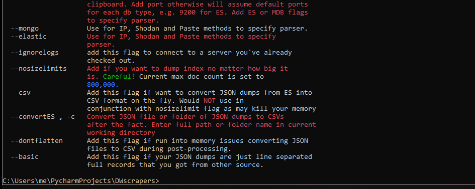

# ODBgrabber

```
    Examples: python ODBgrabber.py -cn US -p 8080 -t users --elastic --shodanquery --csv --limit 100
              python ODBgrabber.py -ip 192.168.2:8080 --mongo --ignorelogs --nosizelimits
    _____________________________________________________________________________

usage: odbgrabber.py [-h] [--ip] [--index] [--paste] [--shodanquery] [--limit]
                     [--port] [--country] [--terms] [--mongo] [--elastic]
                     [--ignorelogs] [--nosizelimits] [--csv] [--convertToCSV]
                     [--dontflatten] [--basic]

optional arguments:
  -h, --help            show this help message and exit

Specify IP Options
  --ip , -ip            Query one server. Add port, e.g. '192.165.2.1:8080',
                        or will assume default ports for each db type, e.g.
                        9200 for ES. Add ES or MDB flags to specify parser.

  --index , -i          You know exactly what ES index you want? Go for it.
                        Use this with IP arg and don't forget to add '--
                        elastic' flag
  --paste               Query DBs hosted on line-separated IPs from clipboard.
                        Add port otherwise will assume default ports for each
                        db type, e.g. 9200 for ES. Add ES or MDB flags to
                        specify parser.

Shodan Options
  --shodanquery         Add this flag if using Shodan. Specify ES or MDB w/
                        flags.
  --limit , -l          Max number of results per query. Default is
                        1000.
  --port , -p           Filter by port.
  --country , -cn       Filter by country with two-letter country code.
  --terms , -t          Enter any additional query terms you want here, e.g.
                        'users'' or maybe add additional filters?

Dump Options
  --mongo               Use for IP, Shodan and Paste methods to specify
                        parser.
  --elastic             Use for IP, Shodan and Paste methods to specify
                        parser.
  --ignorelogs          Connect to a server you've already checked out.
  --nosizelimits        Dump index no matter how big it is. Default max doc
                        count is 800,000.
  --csv                 Convert JSON dumps into CSV format on the fly. (Puts
                        JSON files in backup folder in case there is issue
                        with coversion)

Post-processing<
  --convertToCSV , -c   Convert JSON file or folder of JSON dumps to CSVs
                        after the fact. Enter full path or folder name in
                        current working directory
  --dontflatten         Use if run into memory issues converting JSON files to
                        CSV during post-processing.
  --basic               Use with CSV flag if your JSON dumps are just line
                        separated full records that you got from other
                        sources.
 ```
Wrote this as wanted to create one-stop OSINT tool for searching, parsing and analyzing open databases in order to get the data I care about as damn is there a lot of junk being hosted out there. Other tools seem to either only query open databases or dump them once you've identified them. Grew from function or two into what's in this repo, so code isn't as clean and pretty as it could be.

In terms of identifying databases you can:
* query Shodan using all possible paramters (filter by country, port number, whatever)
* specify single database or single database and index
* paste from list of IP addresses you have

This will also keep track of all the IP addresses and databases you have queried and will check to make sure you haven't already queried the IP. But if you want to connect to server you have already connected to, you have that option.

See the odbconfig.py file to specify your parameters, because really name of the game is getting data YOU care about. I provided some examples in the config file. Play around with them!

The minimum size database script will dump is 40 documents and max is <b>800000</b>, but you can set flag to grab database with unlimited number of documents if you like. Just be careful. If you don't set "nolimit" flag, script will create file with indices/collections that were too big along with a sample entry from the index so you can take a look and see if want to grab them later.

<b>Some features/Notes:</b>
* specify what index or collection names you want to collect by specifying substrings in config file. For example, if have the term "client", script will pull index called "clients" or "client_data." I recommend you keep these lists blank as you never know what databases you care about will be called and instead specify the fields you care about.
* specify what fields you care about: if you only want to grab ES indicdes that have  "email" in a field name, e.g."user_emails", you can do that. If you want to make sure the index has at least 2 fields you care about, you can do that too. Or if you just want to grab everything no matter what fields are in there, you can do that too.
* As you may have noticed, lot of people have been scanning for MongoDB databases and holding them hostage, often changing name to something like "TO_RESTORE_EMAIL_XXXRESTORE.COM." My MongoDb scraper will ignore all databases and collections that have been pwned by checking name of DB/collection against list of strings that indicate pwnage (check it in mongodbscraper function if want to add your own terms)
* ignore index names that are generally used for basic logging, e.g. index names with ".kibana" in them. These are coded within functions, so if want to change these, will need to dig into code
* Script is pretty verbose, maybe too verbose, but I like seeing what's going on. Feel free to silence print statements if you don't care.
* Default output is JSON. You can convert the files to CSV on the fly or you can run script after you dump ES instance to only convert files you care about to JSON. Whatever you want. <b>NOTE:</b> When converting to CSV, script drops exact duplicate rows, drop scolumns and rows where all values are NaN, because that's what I wanted to do. Feel free to edit function if you'd rather gave exact copy. 
* If you already have JSON files that you have dumped from other sources, you can convert them to CSV with the script
* If script pulls back huge number of indices that have field you care about, script will list names of the dbs, pause and give you ten seconds to decide whether you want to go ahead and pull all the data from every index as I've found if you get too many databases returned, there is a good chance data is fake or useless logs and you can usually tell from name whether it's just bunch of dbs with fake sample data. If you don't act within 10 seconds, script will go ahead and dump every index.

<b>Installation and Reqs</b>
* Clone or download to machine
* configure parameters in ODBconfig.py file
* install requirements from file

I suggest creating virtual environment for scripts so have no issues with incorrect module versions.
<b>Note:</b> Tested ONLY on Python 3.7 and on Windows

Next steps are to clean up code a bit more and multithread processes.
At the moment the tool only works with Elastic and MongoDB, but have plans to expand in time.
